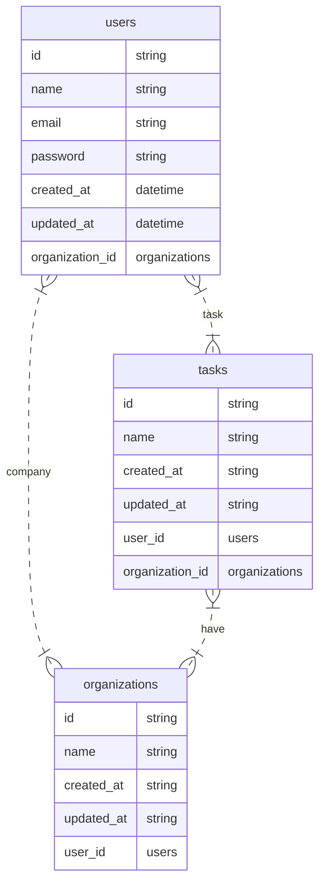

```mermaid
erDiagram

  users {
  id string
  name string
  email string
  password string
  created_at datetime
  updated_at datetime
  organization_id organizations
  }

  organizations {
   id string
   name string
   created_at string
   updated_at string
   user_id users
  }

  tasks {
   id string
   name string
   created_at string
   updated_at string
   user_id users
   organization_id organizations
  }

  users }|..|{ organizations: company
  users }|..|{ tasks: task
  tasks }|..|{ organizations: have
```
